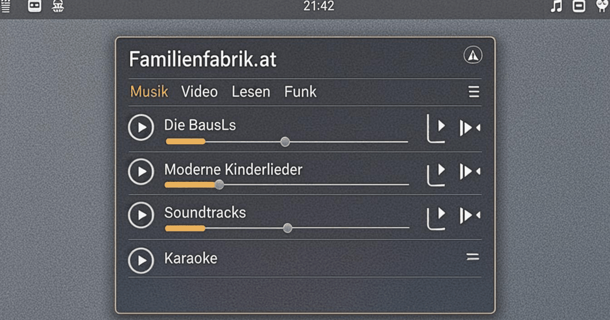

# Familienfabrik.at · Omarchy-PlugIn

> **Omarchy Tools aus der FamilienFabrik** – Musik mit allen Playlisten der
> Website, Fabrik-Videos, Geschichten zum Lesen und Fabrik-Funk direkt aus
> der Quattro-Leiste. Von Familie BausL (Lübeck), für alle, die ihre Fabrik
> immer dabei haben wollen.

[](CHANGELOG.md)
[](LICENSE)

Ein `bar-widget` für [Omarchy 4](https://omarchy.org) (Arch Linux + Hyprland + Quickshell-Shell). Die Leiste zeigt ein ♪-Symbol (der aktuelle Titel steht im Tooltip), ein Klick öffnet das Panel mit vier Werkstätten: **Musik**
(MPRIS-Steuerung + Playlist-Browser mit allen Playlisten von
familienfabrik.at), **Video** (mpv-Launcher + die Fabrik-Videos inklusive
Untertitel), **Lesen** (Geschichten direkt im Panel, ganz ohne Browser) und
**Funk** (News-Feed, der im Panel aufklappt + Toolbox-Schnellstart).



---

## Features

| # | Werkstatt | Was es tut |
|---|-----------|------------|
| 1 | ♪ **Musik-Player** | ♪-Symbol in der Leiste (Titel im Tooltip), Mittelklick = Play/Pause. Panel: Zurück/Play-Pause/Weiter/**Stopp**, Lautstärke-Regler, Fortschrittsbalken mit Zeitangabe (Klick spult), Shuffle an/aus, Loop aus/Titel/Liste. |
| 2 | **Playlist-Browser** | ALLE Playlisten der Website auf einen Blick: Die BausLs, Moderne Kinderlieder **Vol. 1 + Vol. 2**, Soundtracks, Karaoke, Hörbücher, Coversongs **und das Mitsingen-Lied „Gute Laune“**. Playlist wählen → **40 echte Songtitel mit Dauern stehen sofort im Katalog** (Titel · m:ss · Gesamtdauer, ohne yt-dlp-Wartezeit), **alle Titel laufen automatisch nacheinander** (M3U in mpv) und die Liste zeigt jeden Song zum direkten Auswählen – ein Klick springt dorthin und spielt ab dort weiter. Das Mitsingen-Lied liegt als **direktes MP3** auf der Website und startet deshalb **ohne yt-dlp**; `↗ text` öffnet die Mitsing-Seite, auf der der Text zur Musik mitläuft. „▸ alle soundcloud-playlisten laden“ holt zusätzlich immer den aktuellen Stand des Profils. Eigene URLs via yt-dlp-Import (mit klaren Fehlermeldungen, falls yt-dlp fehlt). |
| 3 | ▶ **Video-Player** | YouTube-Links, YouTube-Playlisten und lokale Dateien an `mpv` übergeben. **Fabrik-Videos:** die Wiedergabeliste „Animierte Kinderlieder“ inklusive Untertiteln (de/en, sofern vorhanden) – einzeln oder komplett nacheinander. Verlauf „zuletzt genutzt“ wird lokal gespeichert. |
| 4 | ✎ **Lesen** | Die Geschichten von familienfabrik.at/geschichten (Fahrrad-Gang Bände 1–4 + alle Einzelnsgeschichten) **direkt im Panel lesen** – der Text wird per `curl` geholt, ohne Browser. „↗“ öffnet die Originalseite, wenn gewünscht. |
| 5 | **Fabrik-Funk** | News-Feed (RSS) von familienfabrik.at: Beiträge **klappen im Panel auf** (inkl. Beschreibungstext) – der Browser bleibt optional. Darunter der **Toolbox-Schnellstart** (QR-Codes, Passwörter, Einheiten, BMI, IP & 5 weitere Werkzeuge). |

Alles läuft als reine Prozessaufrufe (`playerctl`, `mpv`, `yt-dlp`, `curl`,
`xdg-open`) – **keine** externen QML-Bibliotheken, keine Hintergrund-Dienste,
kein Tracking. Farben und Schrift folgen automatisch dem **Omarchy-Theme**
(barForeground + Theme-Akzentfarbe).

---

## Voraussetzungen

- **Omarchy 4** mit Quattro-Leiste (Quickshell-Shell)
- **playerctl** – Pflicht für Titelanzeige und Transport (ist auf Omarchy
  vorinstalliert)
- **mpv** – für Wiedergabe von Musik-Playlisten und Videos (empfohlen)
- **yt-dlp** – für den Playlist-Import und YouTube in mpv (empfohlen)
- **curl** – für Fabrik-Funk, Geschichten und Toolbox (empfohlen)

Ohne die „empfohlenen“ Werkzeuge läuft das PlugIn trotzdem: Leisten-Widget
und Panel öffnen sich, nur Wiedergabe/Import/Feed/Lesetexte zeigen dann
keinen Erfolg. Nachrüsten (optional):

```bash
sudo pacman -S mpv yt-dlp curl
```

---

## Installation

### Variante A · Ein Befehl (empfohlen)

```bash
omarchy plugin add https://github.com/bussdeeAI/at.familienfabrik_omarchy.git --enable
```

Danach in der Leiste rechts das **♪**-Widget anklicken – fertig.

### Variante B · ZIP-Download (manuell)

1. ZIP von der [PlugIn-Website](https://familienfabrik.at) herunterladen
   (oder GitHub: grüner **Code**-Button → **Download ZIP**).
2. Entpacken und den Ordner an den richtigen Ort legen:

   ```bash
   mkdir -p ~/.config/omarchy/plugins/at.familienfabrik.omarchy
   unzip familienfabrik-omarchy-plugin-1.1.0.zip \
     -d ~/.config/omarchy/plugins/at.familienfabrik.omarchy
   ```

3. Aktivieren:

   ```bash
   omarchy plugin enable at.familienfabrik.omarchy
   ```

> ⚠️ **Wichtig – Ordnername:** Der Zielordner muss **exakt**
> `at.familienfabrik.omarchy` heißen. GitHub-ZIPs entpacken in einen Ordner
> mit Branch-Suffix: `at.familienfabrik_omarchy-main`. Diesen Suffix-Ordner
> **umbenennen** oder die Dateien direkt in den korrekt benannten Ordner
> verschieben – sonst findet die Shell das Manifest nicht.

---

## Prüfen & Testen

```bash
# Manifest + Struktur validieren (sollte ohne Fehler durchlaufen)
omarchy plugin validate ~/.config/omarchy/plugins/at.familienfabrik.omarchy

# QML gegen die Shell-Imports linten (optional, gründlicher)
qmllint -I "$OMARCHY_PATH/shell" \
  ~/.config/omarchy/plugins/at.familienfabrik.omarchy/BarWidget.qml \
  ~/.config/omarchy/plugins/at.familienfabrik.omarchy/Panel.qml

# Status abfragen (sollte "enabled": true zeigen)
omarchy plugin list --json

# Panel ohne Klick öffnen/schließen (Lebenszyklus-Test)
omarchy-shell shell summon at.familienfabrik.omarchy '{}'
omarchy-shell shell hide   at.familienfabrik.omarchy

# Im Repository-Klon: dieselben Prüfungen laufen lassen wie die CI
node tools/validate-plugin.mjs
```

---

## Bedienung

| Aktion | Effekt |
|---|---|
| Linksklick auf das ♪-Widget | Panel öffnen/schließen |
| Mittelklick auf das ♪-Widget | Play/Pause (auch bei geschlossenem Panel) |
| Klick auf `⏸`/`▶` (||) | Play/Pause – zielt **gezielt auf unser mpv** (`playerctl -p mpv play-pause`), auch wenn parallel andere Player (Browser …) laufen |
| Klick auf `■` | **Stopp** – beendet die Wiedergabe komplett (Musik *oder* Video): `playerctl -p mpv stop` plus sicheres Prozessende; Anzeige springt auf „keine wiedergabe“ |
| `ESC` | Panel schließen |
| Klick auf den Fortschrittsbalken | An die Klickposition spulen (`playerctl position`), Zeit „m:ss / m:ss“ |
| Klick auf `⇄` | Shuffle an/aus (`playerctl shuffle toggle`) – aktiver Zustand leuchtet in der Theme-Akzentfarbe |
| Klick auf `↻` | Loop umschalten: aus → Titel (`↻1`) → Liste (`↻∞`) → aus (`playerctl loop`) |
| Playlist in der Übersicht anklicken | **Titel erscheinen sofort** (echter Song-Katalog) → **ganze Playlist läuft nacheinander ab** → Titelliste mit Dauern + Gesamtdauer |
| Mitsingen-Lied anklicken | „Gute Laune“ startet sofort (**direktes MP3, ohne yt-dlp**); `↗ text` öffnet den mitlaufenden Text |
| Klick auf einen Titel in der Liste | Springt dorthin; **ab diesem Titel läuft die Playlist weiter** |
| `◂ alle soundcloud-playlisten laden` | Holt den aktuellen Playlist-Stand des SoundCloud-Profils dazu |
| Enter im URL-Feld | Eigene Quelle importieren (Musik) bzw. Wiedergabe starten (Video) |
| Geschichte im Lesen-Tab anklicken | Text wird geladen und **im Panel** lesbar (scrollen, ESC/„◀ liste“ zurück) |
| Beitrag im Funk-Tab anklicken | Klappt im Panel auf (Beschreibungstext); `↗` öffnet den Browser |
| Toolbox-Chip anklicken | Werkzeug im Browser öffnen (interaktive Web-Apps) |

**Playlisten im Detail:** Die Übersicht listet ALLE Alben der Website
(familienfabrik.at/musik) – mit **40 echten Songtiteln samt Dauern**, die
ab Werk im Katalog stehen (Stand 09/2026, ausgelesen aus den öffentlichen
SoundCloud-/hearthis.at-APIs): Die BausLs („Dat geiht“, „Küstenkinder für
immer“, „Nordwind im Herzen“ …), Moderne Kinderlieder **Vol. 1** („Operation
Frischluft“, „Lübeck ruft“, „Gute Laune“ …) und **Vol. 2** („Alle meine
Entchen – Mission See“, „Sesamstraße 2k“ …), Soundtracks („1, 2, 3, Peng“ –
die Fahrrad-Gang), Karaoke (Instrumentals), Hörbücher („Lukas die kleine
Springspinne“), Coversongs (13 Titel von „Im Wald drausst is schön“ bis
„Erlkönig“) und das Mitsingen-Lied „Gute Laune“ – das als direktes MP3 sogar
ohne yt-dlp startet. Eine Playlist anklicken genügt: Die Titelliste steht
**sofort** da (Katalog – kein yt-dlp, keine Wartezeit), das PlugIn schreibt
eine M3U-Datei und `mpv` spielt **alle Titel nacheinander** ab – der Klick
auf einen Song startet die Kette ab genau diesem Titel. Die Leiste zeigt
während der Wiedergabe Titel + Interpret via MPRIS. Schlägt yt-dlp beim
freien Import fehl, zeigt die Statuszeile die Ursache – inklusive
Installations-Hinweis (`sudo pacman -S yt-dlp`).

**Datenquellen** (alle frei zugänglich):

```text
Musik      → familienfabrik.at/musik (SoundCloud + hearthis.at)
Videos     → youtube.com … playlist?list=PLV4Cqp2ak_1wTIJ9HeO5YwoyDAJ4dqFim
Lesen      → familienfabrik.at/geschichten
Funk       → familienfabrik.at/feed.xml
Toolbox    → familienfabrik.at/toolbox
```

---

## Dateibaum

```text
at.familienfabrik.omarchy/
├── manifest.json      # PlugIn-Vertrag (Schema v1, bar-widget, Version)
├── BarWidget.qml      # Leisten-Anzeige: ♪-Symbol, Klick öffnet Panel
├── Panel.qml          # Panel: Musik · Video · Lesen · Funk
├── Model.js           # Kataloge + Parser: playerctl, yt-dlp, RSS, HTML
├── README.md          # diese Datei
├── CHANGELOG.md       # Versionsgeschichte (Keep a Changelog)
├── LICENSE            # MIT
├── preview.png        # Vorschau (~1200×630)
├── .github/           # Repo-Komfort: FUNDING.yml (Spenden) + CI-Workflow
├── tools/             # validate-plugin.mjs – läuft lokal UND in der CI
└── .gitignore
```

Die letzten drei Einträge sind Repository-Komfort (Spenden-Buttons,
automatische Prüfungen) – die Quattro-Shell ignoriert sie, und im
ZIP-Download der PlugIn-Website fehlen sie bewusst: Dort liegen nur die
acht Laufzeit-Dateien.

Nutzerdaten (nicht im PlugIn-Ordner), alles unter
`~/.local/state/familienfabrik/`: `recents.json` (Video-Verlauf) und
`playlist.m3u` (zuletzt gespielte Musik-Playlist). Löschen = Daten leeren.

---

## Deinstallation

```bash
omarchy plugin disable at.familienfabrik.omarchy   # nur deaktivieren
omarchy plugin remove  at.familienfabrik.omarchy   # komplett entfernen
rm -f ~/.local/state/familienfabrik/recents.json   # optional: Verlauf
rm -f ~/.local/state/familienfabrik/playlist.m3u   # optional: letzte Playlist
```

---

## Versionierung & Releases

Dieses PlugIn folgt [SemVer](https://semver.org): `MAJOR.MINOR.PATCH` –
neue Features bedeuten einen MINOR-Bump, Fehlerbehebungen einen
PATCH-Bump. Jede Version

1. steht in `manifest.json` (`"version"`) **und** in der Panel-Fußzeile,
2. bekommt einen Eintrag in der [CHANGELOG.md](CHANGELOG.md),
3. erscheint als GitHub-Release mit Tag `v<Version>` unter
   <https://github.com/bussdeeAI/at.familienfabrik_omarchy/releases>.

Bei jedem Push und Pull Request prüft der CI-Workflow
(`.github/workflows/validate.yml`) das PlugIn automatisch mit denselben
Prüfungen, die auch lokal laufen: `node tools/validate-plugin.mjs` –
Manifest-Schema, QML-Konsistenz, Lifecycle-Vertrag, Kataloge und
Parser-Schnelltests. Wer unterstützt möchte: der **Sponsor**-Button oben
im Repository (PayPal oder [Support-Seite](https://familienfabrik.at/unterstuetzen)).

---

## FAQ (Kurzfassung)

- **Kein Titel in der Leiste?** Es läuft kein MPRIS-Player (oder `playerctl`
  fehlt). Im Panel unter Musik eine Playlist starten – dann erscheint der
  Titel im Tooltip innerhalb von ~2 Sekunden.
- **Songtitel fehlen?** Kann nicht mehr passieren: Die 40 Titel aller
  kuratierten Playlisten stehen ab Werk im Katalog (Model.js) – sie erscheinen
  sofort, ganz ohne yt-dlp. Nur dynamisch geladene Playlisten und eigene
  Importe brauchen yt-dlp; schlägt das fehl, zeigt die Statuszeile die
  Ursache samt Installations-Hinweis.
- **Playlist lädt nicht?** (dynamische/eigene Quellen) Meist fehlt `yt-dlp`
  oder das Netz war weg – die Statuszeile nennt die Ursache. Den „alle
  soundcloud-playlisten laden“-Knopf erneut klicken; eigene URLs
  funktionieren weiterhin über das Import-Feld.
- **Video startet nicht?** Prüfe `mpv` und (für YouTube) `yt-dlp`. Lokale
  Pfade funktionieren mit `/pfad/datei.mp4` oder `~/…`.
- **Geschichte bleibt leer?** Die Seite war nicht erreichbar (20 s Timeout)
  – „◀ liste“ und erneut klicken, oder per `↗` im Browser lesen.
- **Feed bleibt leer?** „feed laden“ erneut klicken (15 s Timeout).

---

## Links

- **Website:** <https://familienfabrik.at>
- **Unterstützen:** <https://familienfabrik.at/unterstuetzen> (auch via
  PayPal: <https://paypal.me/bussdee>)
- **GitHub:** <https://github.com/bussdeeAI/at.familienfabrik_omarchy>
- **Releases & Changelog:**
  <https://github.com/bussdeeAI/at.familienfabrik_omarchy/releases>

## Lizenz

[MIT](LICENSE) · © 2026 Familie BausL – Familienfabrik.at

Omarchy und Hyprland sind Projekte ihrer jeweiligen Eigentümer; dieses
PlugIn ist ein unabhängiges Werk der FamilienFabrik.
